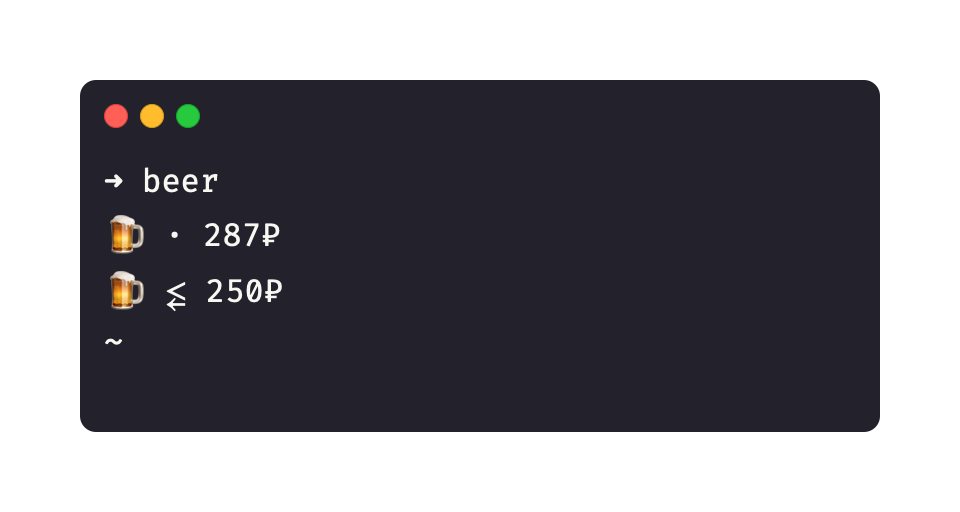

# beer-price

Кому нужен `neofetch`? Я и так знаю какая у меня операционка 
и сколько у меня оперативной памяти.

Лучше получать более важную информацию при запуске терминала, 
например сколько сегодня стоит пиво в среднем и минимально, в баре 
"Выдержка" в "Этажах".
